# @antevo/cli: Antevo from the terminal

**The same MCP connections your assistant uses, scriptable.** Executive, Trademark, Crypto, Wealth and Mandates — reached from a shell, piped through `jq`, run over SSH or in a container. No account for the public three; `antevo login` for the rest.

[](https://www.npmjs.com/package/@antevo/cli)
[](https://www.npmjs.com/package/@antevo/cli)
[](https://registry.modelcontextprotocol.io/v0/servers?search=ch.antevo)
[](#servers)

```bash
npx @antevo/cli brief          # the Executive Brief — no account, no signup
npx @antevo/cli tools          # what's available, live from the server
```

### Why a client, not a wrapper

This speaks MCP to the published connections rather than wrapping a REST API. Two consequences, and they are the reason it is shaped this way:

- **It cannot fall behind.** `tools` and `call` are complete the day a tool appears server-side. A CLI with hardcoded commands would lag every release.
- **There is no second authorisation model.** Scopes are enforced server-side; this inherits them.

## Table of Contents

- [Install](#install)
- [Commands](#commands)
- [Servers](#servers)
- [What you can ask it](#what-you-can-ask-it)
- [Accounts and signing in](#accounts-and-signing-in)
- [Where credentials live](#where-credentials-live)
- [Read-only by default](#read-only-by-default)
- [Ecosystem](#ecosystem)

## Install

```bash
npx @antevo/cli <command>        # nothing to install
npm install -g @antevo/cli       # or keep `antevo` on your PATH
```

Requires Node 20 or later.

## Commands

| Command | What it does |
|:--|:--|
| `antevo brief` | The Executive Brief — no account needed |
| `antevo tools [--server NAME]` | Every tool on a server, live |
| `antevo call <tool> --arg k=v` | Call any tool; JSON in, JSON out |
| `antevo login` | Approve this machine with a device code |
| `antevo whoami` | What this machine can reach |
| `antevo logout` | Forget the stored credentials |

`--server executive|crypto|trademark|wealth|mandates` (default `executive`) · `--json` for the raw payload.

`--arg` values are parsed as JSON when they parse, else kept as strings — so `--arg days=90` sends a number and `--arg mark=NOVARA` sends a string.

## Servers

| `--server` | What it reaches | Account |
|:--|:--|:--|
| `executive` | The daily brief, risk radar, forward calendar, dated archive, desk reads, world map, macro history | None |
| `trademark` | Screening, holder reads, opposition windows | None for screening |
| `crypto` | One reference price per major pair, daily history, technical signals | None |
| `wealth` | Your household | `antevo login` |
| `mandates` | Your firm's client book | A Mandates firm account, then `antevo login` |

## What you can ask it

Every line in this section runs with **no account**. Copy any of them.

**The day**

```bash
npx @antevo/cli brief                                   # today's Executive Brief
npx @antevo/cli call get_risk_radar                     # what could go wrong, graded
npx @antevo/cli call get_catalysts --arg days_ahead=14  # the forward calendar
npx @antevo/cli call get_executive_note --arg as_of=2026-08-09
```

**The desk's own view, one sector at a time** — fourteen areas, each dated

```bash
npx @antevo/cli call list_coverage
npx @antevo/cli call get_coverage --arg area=real-assets-shipping
npx @antevo/cli call get_coverage --arg area=art-core
npx @antevo/cli call get_coverage --arg area=wealth-succession-planning                                  --arg scope=institutional
```

Areas run from `real-assets-shipping`, `real-assets-aviation` and
`real-assets-yachts` through `markets-commodities`, `geopolitics-core`,
`themes-ai-technology`, `themes-energy-transition`, `themes-demographics`,
`wealth-generational-wealth` and `art-core`. `list_coverage` is authoritative —
it carries each area's own latest date, because the desk does not write every
area every day.

**Where it is happening** — nine layers

```bash
npx @antevo/cli call get_world_events --arg layers=waterways
npx @antevo/cli call get_world_events --arg layers=submarine_cables
npx @antevo/cli call get_world_events --arg layers=disasters,displacement                                      --arg days_back=30
```

Layers: `waterways` · `submarine_cables` · `armed_conflicts` · `disasters` ·
`displacement` · `sanctions` · `cyber` · `regulatory` · `hotspots`.

**Ask for the layers you want.** All of them together run to roughly 40k tokens
with two truncated; narrow to one or two and the row budget the rest were
spending is yours. This is the argument that most changes what you get back.

**The long run** — around 180 countries, some series to 1920

```bash
npx @antevo/cli call search_macro_indicators --arg query=CPI --arg country=Switzerland
npx @antevo/cli call get_macro_series --arg ticker="CHE CPI" --arg since=2020-01-01
npx @antevo/cli call search_macro_indicators --arg query="house prices" --arg limit=25
npx @antevo/cli call search_macro_indicators --arg query="policy rate" --arg country=JPN
```

`country` takes a name (`Switzerland`) or an ISO-3 code (`CHE`). Search first —
there are around 80,000 series and the naming is not uniform, so guessing a
ticker does not work.

Two things worth knowing before you quote a number: these are **quarterly
published levels that lag** (the newest observation is a quarter end, never
today, and `covers.to` differs between series), and index levels are only
comparable *within* one series — compare changes, not levels.

**Trademark**

```bash
npx @antevo/cli call screen_mark --server trademark --arg mark=NOVARA
npx @antevo/cli call opposition_window --server trademark --arg office=EM
```

**Crypto**

```bash
npx @antevo/cli call list_crypto_pairs --server crypto
npx @antevo/cli call get_crypto_price --server crypto --arg symbol=BTC/USD
npx @antevo/cli call get_crypto_price_history --server crypto --arg symbol=ETH/EUR --arg days=90
npx @antevo/cli call get_crypto_technicals --server crypto --arg symbol=SOL/USD
```

One reference price per pair: a composite across major exchanges, volume-weighted, with outlying quotes excluded. Whole UTC days only — not a live or tradable quote. Technical signals say how indicators lean, never buy or sell.

**Piping**

`--json` gives you the raw payload, so the whole surface composes:

```bash
npx @antevo/cli call list_coverage --json | jq -r '.areas[].area'
npx @antevo/cli call get_coverage --arg area=real-assets-shipping --json | jq -r .note
```

**After `antevo login`**

```bash
npx @antevo/cli tools --server wealth
npx @antevo/cli tools --server mandates
npx @antevo/cli call get_client_reviews_due --server mandates
```

`antevo login` asks for read access, so from this CLI the Mandates tools that change a record refuse rather than write.

## Accounts and signing in

`antevo login` uses RFC 8628 device authorization: it prints a URL and a code,
you approve in a browser, it polls. No localhost redirect, so it works over SSH
and inside a container.

## Where credentials live

`~/.antevo/credentials.json`, mode 0600.

**Not the OS keychain, and that is a known limitation rather than an oversight.**
Keychain bindings are native modules, and a native dependency turns
`npx @antevo/cli` — the one-command story this exists for — into a compile step
that fails differently on every machine. Access tokens are short-lived (10
minutes) and read-only by default; the refresh token is the asset worth
protecting, and moving it behind an optional keychain dependency is the
follow-up. `antevo logout` removes the file.

## Read-only by default

Nothing here trades, moves money, or changes a position. The sign-in this CLI requests is read-only, so no tool that writes will run from it.

## Ecosystem

| Repository | What it is |
|:--|:--|
| [**ANTEVO-CH/plugins**](https://github.com/ANTEVO-CH/plugins) | The same connections as Claude plugins, with 28 skills |
| [**ANTEVO-CH/antevo-mcp**](https://github.com/ANTEVO-CH/antevo-mcp) | Connection metadata for Cursor, VS Code and Gemini CLI |
| [**ANTEVO-CH/cli**](https://github.com/ANTEVO-CH/cli) | This client |

---

<p align="center">
  <b>Antevo</b> · Switzerland · <a href="https://antevo.ch/mcp">antevo.ch/mcp</a> · <a href="mailto:contact@antevo.ch">contact@antevo.ch</a><br>
  <sub>Intelligence, not advice.</sub>
</p>
